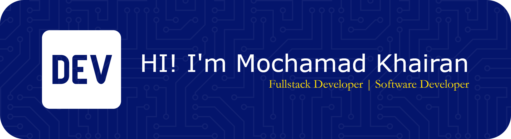

## Hi there 👋
# 💫 About Me:
## Hi there 👋

## 🌐 Socials:
    

# 💻 Tech Stack:
                    
# 📊 GitHub Stats:
 
 

## 🏆 GitHub Trophies

### ✍️ Random Dev Quote

---

<!-- Proudly created with GPRM ( https://gprm.itsvg.in ) -->